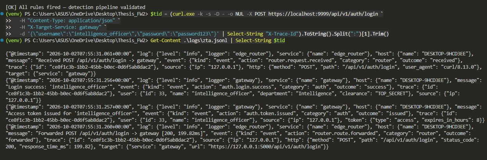
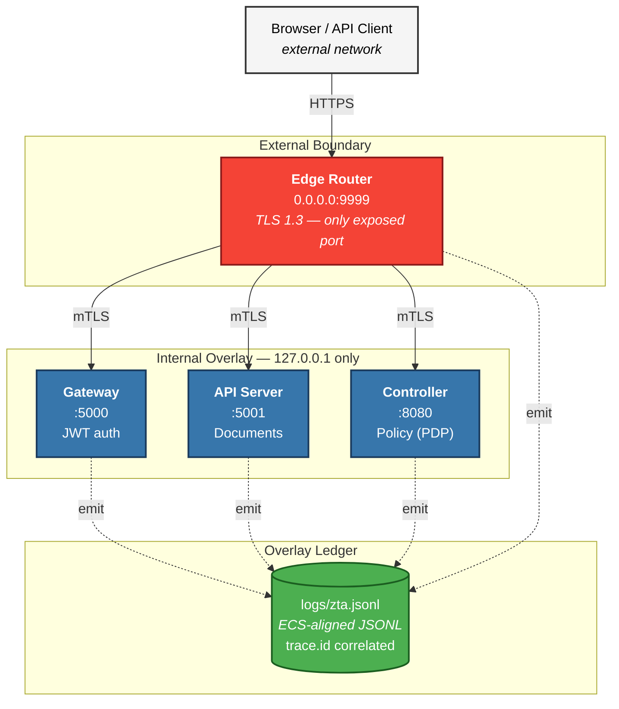
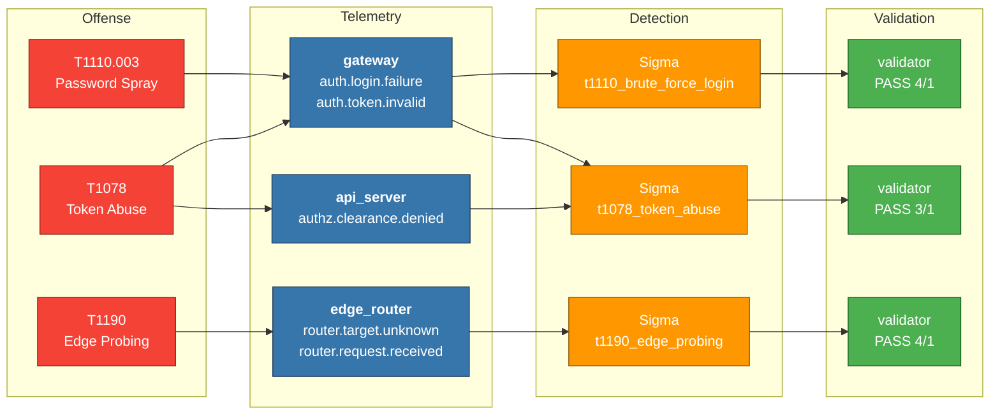
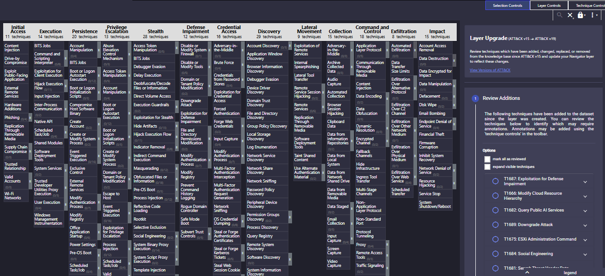
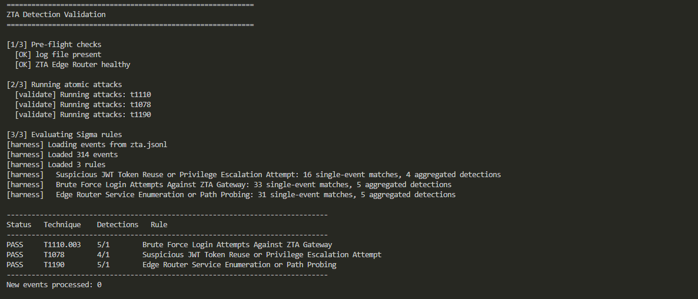

<!-- ════════════════════════════════════════════════════════════════════
     HERO
     ════════════════════════════════════════════════════════════════════ -->

<p align="center">
  
</p>

<h1 align="center">Overlay Ledger</h1>

<h3 align="center">A Zero Trust overlay network with detection-as-code</h3>

<p align="center">
  <em>Every service behind one gate. Every request logged. Every attack detected.</em>
</p>

<p align="center">
  <a href="#"></a>
  <a href="#"></a>
  <a href="#"></a>
  <a href="#"></a>
  <a href="#"></a>
  <br>
  <a href="#"></a>
  <a href="#"></a>
  <a href="#"></a>
  <a href="#"></a>
  <a href="#"></a>
</p>

<p align="center">
  <a href="#overview">Overview</a> •
  <a href="#architecture">Architecture</a> •
  <a href="#detection-engineering">Detection Engineering</a> •
  <a href="#getting-started">Getting Started</a> •
  <a href="#findings">Findings</a> •
  <a href="#roadmap">Roadmap</a>
</p>

---

## Overview

**Overlay Ledger** is a two-layer project:

1. **A Zero Trust overlay network** built in Flask, where every service binds to `127.0.0.1` and only a single Edge Router on port `9999` is reachable from outside. It implements a Bangladesh government clearance hierarchy (`BASIC → CONFIDENTIAL → SECRET → TOP_SECRET`), department isolation, business-hours access control, and end-to-end AES-256-GCM encryption with RSA-2048 key wrapping.

2. **A detection-as-code pipeline** that turns every service into a structured log producer, evaluates Sigma rules against those logs with sliding-window aggregation, and validates each rule with safe atomic attack simulations mapped to MITRE ATT&CK.

The two layers are designed together: the overlay produces the telemetry, the detection layer proves the telemetry is useful.

<p align="center">
  
  <br>
  <em>One user request → four events across two services, correlated by <code>trace.id</code>.</em>
</p>

### Why this exists

Most portfolio security projects pick one side of the fence: build a secure system **or** build a detection pipeline. Overlay Ledger does both, you can't detect what you can't see, and you can't trust what you can't verify.

---
### Architecture



### Components

| Component | Port | Bind | Role |
|-----------|------|------|------|
| **Edge Router** | `9999` | `0.0.0.0` | Single entry point. Proxies every external request to backend services over mTLS. Emits `router.*` events. |
| **Gateway** | `5000` | `127.0.0.1` | JWT authentication, token lifecycle, admin endpoints. Emits `auth.*` events. |
| **API Server** | `5001` | `127.0.0.1` | Document retrieval with clearance + department + business-hours enforcement. Emits `authz.*` events. |
| **Controller** | `8080` | `127.0.0.1` | Policy Decision Point. Evaluates YAML policy, enrolls identities. Emits `policy.*` and `service.*` events. |

### External attack surface

```text
$ nmap -Pn -p 5000,5001,8080,9999 192.168.0.112
Starting Nmap 7.991 ( https://nmap.org ) at 2026-09-26 22:04 +0600
Nmap scan report for host.docker.internal (192.168.0.112)
Host is up (0.00067s latency).

PORT     STATE  SERVICE
5000/tcp closed upnp
5001/tcp closed commplex-link
8080/tcp closed http-proxy
9999/tcp open   abyss

Nmap done: 1 IP address (1 host up) scanned in 0.66 seconds
```

Everything else is invisible to the LAN. This is the ZTA premise in one command.

### Request flow

```text
Browser → Edge Router (:9999)
            │
            ├─ [router.request.received]  (log)
            │
            ├─ mTLS → Gateway / API Server / Controller (127.0.0.1)
            │            │
            │            ├─ [auth.* | authz.* | policy.*]  (log)
            │            │
            │            └─ response
            │
            └─ [router.route.forwarded]  (log)
```

> Every arrow generates a structured event with a shared `trace.id`, enabling full request reconstruction during investigation.

### Security mechanisms

| Layer | Mechanism |
|-------|-----------|
| **Transport** | TLS 1.3 (self-signed CA), mTLS between Edge Router and backends |
| **Authentication** | JWT access tokens (8h), refresh tokens (7d), blacklist on logout |
| **Authorization** | YAML-based access policies evaluated by the Controller (PDP) |
| **Data-at-rest** | AES-256-GCM with RSA-2048 key wrapping; browser-side decryption |
| **Access control** | Clearance hierarchy + department isolation + business-hours rule for `TOP_SECRET` |
| **Network** | Loopback-only binding for all backend services |

---

## Detection Engineering




### The pipeline

```text
┌─────────────────┐    ┌──────────────────┐    ┌────────────────┐    ┌──────────────┐
│ Atomic attacks  │ →  │ ZTA services     │ →  │ Sigma rules    │ →  │ Validator    │
│ (T1110/T1078/   │    │ emit JSONL       │    │ evaluated with │    │ PASS/FAIL    │
│  T1190)         │    │ (ECS-aligned)    │    │ sliding window │    │ per rule     │
└─────────────────┘    └──────────────────┘    └────────────────┘    └──────────────┘
   detections/             logs/zta.jsonl          detections/          detections/
   atomic/run.py                                  sigma/*.yml          validate.py
```

### Sigma rules

| Rule | Technique | Trigger | Level |
|------|-----------|---------|-------|
| [`t1110_brute_force_login.yml`](detections/sigma/t1110_brute_force_login.yml) | **T1110.003** Password Spraying | 5+ `auth.login.failure` from same `source.ip` in 60s | `medium` |
| [`t1078_token_abuse.yml`](detections/sigma/t1078_token_abuse.yml) | **T1078** Valid Accounts / **T1550.001** | 3+ `auth.token.invalid` OR `authz.clearance.denied` from same `source.ip` in 120s | `high` |
| [`t1190_edge_probing.yml`](detections/sigma/t1190_edge_probing.yml) | **T1190** Exploit Public-Facing App / **T1046** | 3+ `router.target.unknown` OR suspicious-path `router.request.received` from same `source.ip` in 60s | `high` |

### ATT&CK coverage

<p align="center">
  
  <br>
  <em>Layer file: <a href="detections/attack_layer.json"><code>detections/attack_layer.json</code></a></em>
</p>

- 🟢 **Green** — covered by a deployed, validated Sigma rule
- 🟡 **Yellow** — partial coverage
- 🔴 **Red** — relevant to ZTA threat model but not detected (documented gap)

### Validation

<p align="center">
  
</p>

```text
Status   Technique    Detections   Rule
------------------------------------------------------------------------------
PASS     T1110.003    4/1          Brute Force Login Attempts Against ZTA Gateway
PASS     T1078        3/1          Suspicious JWT Token Reuse or Privilege Escalation Attempt
PASS     T1190        4/1          Edge Router Service Enumeration or Path Probing
------------------------------------------------------------------------------
[OK] All rules fired — detection pipeline validated
```

Run it yourself:

```powershell
python -m detections.validate
```

See [`detections/README.md`](detections/README.md) for the full detection documentation.

---

## Getting Started

### Prerequisites

- Python 3.11+
- Git
- *(Optional)* Nmap, Wireshark, Sysmon for extended testing

### Install

```powershell
git clone <your-repo-url>
cd overlay-ledger
python -m venv venv
.\venv\Scripts\Activate.ps1
pip install -r requirements.txt
```

### Generate certificates (one-time)

```powershell
python certs/generate_identities.py
```

### Run the overlay

```powershell
python start_overlay_network.py
```

Expected output:

```text
Overlay Ledger is RUNNING with PROPER SSL!

🌐 Access Points (HTTPS only):
  • Edge Router: https://localhost:9999
  • Gateway:     https://localhost:5000
  • API Server:  https://localhost:5001
  • Controller:  https://localhost:8080
```

### Test login

```powershell
curl.exe -k -X POST https://localhost:9999/api/v1/auth/login `
  -H "Content-Type: application/json" `
  -H "X-Target-Service: gateway" `
  -d '{\"username\":\"intelligence_officer\",\"password\":\"password123\"}'
```

### Run the detection pipeline

In a second terminal:

```powershell
# Fire the atomic attacks
python -m detections.atomic.run

# Evaluate rules against the resulting logs
python -m detections.harness --verbose

# Or run the full PASS/FAIL validator
python -m detections.validate
```

---

## Findings

Real bugs found and fixed during the observability work. These are documented because SOC work is fundamentally about noticing what's wrong — even in your own code.

### 1. Fail-open Policy Decision Point

> **Severity:** `high`

**Symptom** : During initial testing, a request with `source=attacker, target=api_server` was **allowed** by the Controller.

**Root cause** : Two compounding issues:

- The Controller expected `config/policies/access_policies.yaml` *(underscore)*, but the file on disk was `access-policies.yaml` *(hyphen)*.
- The `except FileNotFoundError` branch in `check_policy()` returned `{"allowed": True}` : a fail-open design.

**Impact** — Any misconfiguration or typo in the policy file path silently disabled all access control. The PDP would approve any policy check.

**Fix:**

```python
except FileNotFoundError:
    emit_event(logger, AUTHZ_POLICY_DENIED,
               message=f"Policy file missing at '{policies_path}'; denying request",
               reason="policy_file_missing", severity="high")
    return jsonify({'allowed': False, 'error': 'Policy engine unavailable'}), 503
```

Fails closed, emits a high-severity event, and returns `503` (not `403`) so callers can distinguish *"policy engine is broken"* from *"policy says no."*

### 2. Contextvar scope bug in structured logger

> **Severity:** `medium`

**Symptom** — Log events emitted during request handling showed `"service": {"name": "unknown"}` instead of the correct service name.

**Root cause** — The initial `logging_config.py` used a `ContextVar` to hold the service name. Flask runs each request in its own thread/context, and contextvars set at module load don't propagate to worker threads.

**Fix** — Attach the service name to the log record via a `logging.Filter` in `setup_logger()`, so it's available regardless of thread.

### 3. Trace ID propagation gap

> **Severity:** `low` — but degrades investigation quality

**Symptom** — Early logs had no correlation across services. A single request produced three unrelated log lines.

**Fix** — Added `@app.before_request` and `@app.after_request` hooks to all four services. The Edge Router forwards `X-Trace-Id` to backends; every service echoes it in responses. Now one request → four correlated events.

---

## Design Notes

### Why Sigma instead of native SIEM rules

Sigma is vendor-neutral. These rules can be converted to Splunk SPL, Elastic Lucene, Sentinel KQL, or Wazuh XML with [`sigma-cli`](https://github.com/SigmaHQ/sigma-cli). That portability means the detection *logic* is portable, and a detection engineer's job is to write logic, not bind it to one vendor.

### The `aggregation` extension

Sigma's spec covers single-event matching. Time-window correlation (*"N events in M seconds"*) is SIEM-specific. Rather than use a non-standard workaround, `group_by` and `aggregation` are documented extensions that the harness reads. When converting to a specific SIEM, that block gets rewritten in the target's native syntax.

### Why `source.ip` is `127.0.0.1` in the demo

Everything runs on one Windows host for the demo. The Edge Router forwards `X-Forwarded-For`, so in a real deployment, `source.ip` would be the true client IP. The detection logic is identical.

---


## References

- [MITRE ATT&CK Enterprise](https://attack.mitre.org/)
- [Sigma HQ rule specification](https://github.com/SigmaHQ/sigma-specification)
- [pySigma](https://github.com/SigmaHQ/pySigma) — Sigma rule conversion library
- [Elastic Common Schema (ECS)](https://www.elastic.co/guide/en/ecs/current/index.html)
- [ATT&CK Navigator](https://mitre-attack.github.io/attack-navigator/)
- [OpenZiti](https://openziti.io/) — inspiration for the overlay model

---

## Author
@Zoye-J
Built as a personal security engineering portfolio project. Feedback welcome via issues.

---

<p align="center">
  <sub>Built with the belief that visibility is the first prerequisite for trust.</sub>
</p>